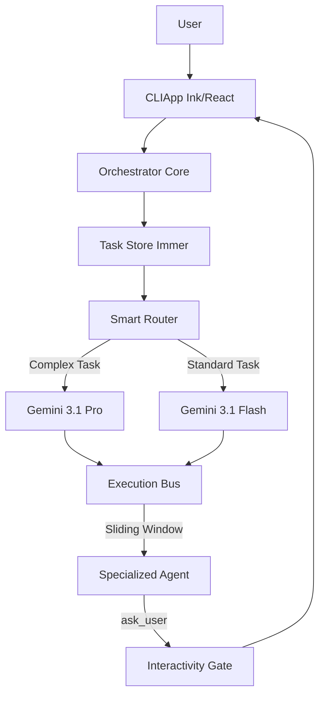

# Nexus-Prime: The Autonomous Multi-Agent Framework

[](https://github.com/MDHaarith/nexus-prime)
[](LICENSE)

Nexus-Prime is a cutting-edge, high-performance orchestration framework designed to automate complex software engineering workflows. Built on a unified Node.js/TypeScript core, it manages a specialized swarm of **28 domain-expert agents** that collaborate through a deterministic 12-phase execution pipeline.

By combining a reactive **Ink (React) CLI** with an intelligent **Execution Bus**, Nexus-Prime provides a professional-grade environment where AI agents can research, plan, implement, and verify tasks with unprecedented precision and cost-efficiency.

## 🌟 Architectural Innovations

### 1. Flash-First Orchestration
Nexus-Prime optimizes for speed and cost by defaulting all standard operations to **Gemini 3.1 Flash**. The system features a **Smart Router** that dynamically upgrades complex architectural or security-sensitive tasks to **Gemini 3.1 Pro** only when necessary, ensuring the highest intelligence-to-cost ratio.

### 2. Execution Bus & Context Management
To solve the problem of LLM context bloat, our **Execution Bus** implements a **3-Handoff Sliding Window**. Agents only receive the most relevant immediate history, combined with an O(1) byte-counting pruner that keeps the core logic within optimal token limits (under 8,000 characters).

### 3. Reactive Terminal UI (Ink Pro)
Unlike standard text-based CLIs, Nexus-Prime features a modern interface built with **Ink (React)**. This provides:
- **Real-time Progress Tracking**: Live status updates for each development phase.
- **Interactivity Gates**: A dedicated mechanism that pauses autonomous execution to ask for user clarification, preventing drift and ensuring alignment.
- **Structured Telemetry**: Every agent action is logged as structured JSON for easy debugging and observability.

### 4. Deterministic 12-Phase Workflow
Every project follows a rigorous lifecycle:
- **Design**: Requirements, Architecture, Convergence.
- **Plan**: Component Analysis, Agent Assignment, Dependency Mapping.
- **Execute**: Implementation, Testing, Refactoring.
- **Complete**: Security Audit, Documentation, Final Validation.

## 🏗️ System Overview



## 🚀 Installation

To install Nexus-Prime as a Gemini CLI extension, run:

```bash
gemini extension install https://github.com/MDHaarith/nexus-prime
```

## 🤝 Contributing
We follow strict TypeScript standards and the Interactivity-First mandate. See [CONTRIBUTING.md](CONTRIBUTING.md) for details.

## 📄 License
This project is licensed under the MIT License - see the [LICENSE](LICENSE) file for details.
