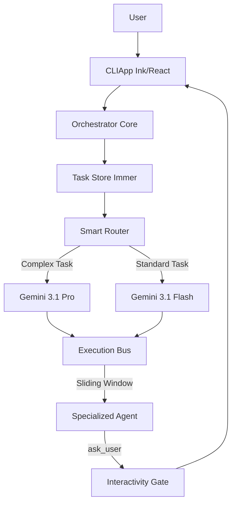

# Nexus-Prime: The Autonomous Multi-Agent Framework

[](https://github.com/MDHaarith/nexus-prime)
[](LICENSE)

Nexus-Prime is a cutting-edge, high-performance orchestration framework designed to automate complex software engineering workflows. Built on a unified Node.js/TypeScript core, it manages a specialized swarm of **28 domain-expert agents** that collaborate through a deterministic 12-phase execution pipeline.

By combining a reactive **Ink (React) CLI** with an intelligent **Execution Bus**, Nexus-Prime provides a professional-grade environment where AI agents can research, plan, implement, and verify tasks with unprecedented precision and cost-efficiency.

---

## 🌟 Key Features

- **Flash-First Model Tiering**: Defaulting to Gemini 3.1 Flash for maximum speed and cost-efficiency, with automated upgrades to Gemini 3.1 Pro for complex architectural and security tasks.
- **3-Handoff Sliding Window**: A high-efficiency execution bus that maintains a focused context window of the last 3 task handoffs, preventing token bloat and reducing latency.
- **Reactive Ink UI**: A modern, interactive CLI built with React and Ink, featuring real-time progress tracking, task logs, and a dedicated interactivity gate for user input.
- **28 Domain Experts**: A comprehensive swarm of specialized agents covering everything from API design and cloud architecture to security auditing and performance engineering.
- **Interactivity First**: A core mandate that ensures agents always ask for clarification when encountering ambiguity, keeping the system perfectly aligned with user intent.
- **O(1) Efficiency**: Optimized performance path using pre-mapped dependencies and byte-counting context management.

---

## 🏗️ Architecture

Nexus-Prime leverages a sophisticated multi-layered architecture to ensure reliability and scalability in autonomous workflows.



### Core Components

| Component | Description |
|-----------|-------------|
| **Orchestrator** | The brain of the system. It breaks down high-level objectives into actionable phases and delegates them to specialized agents. |
| **TaskStore** | An immutable state management system powered by **Immer**. It tracks the status, results, and history of every task in the session. |
| **ExecutionBus** | The communication layer that manages agent dispatch, context pruning (8k limit), and result collection. |
| **SmartRouter** | An intelligent routing engine that selects the optimal model (Flash vs Pro) based on task complexity using LLM classification. |
| **SkillFactory** | A dynamic generator that assembles agent capabilities from modular skill definitions. |

---

## 🛠️ Built-in Skills

Nexus-Prime comes pre-equipped with a modular library of **Specialized Skills**. These skills provide the underlying logic and best practices that agents use to execute their tasks.

### Core Capability Skills
- **Automated Documentation**: Native ability to generate OpenAPI/Swagger specs, JSDoc/TypeDoc references, and maintain synchronized READMEs.
- **CI/CD Integration**: Pre-configured workflows for GitHub Actions, Jenkins, and Docker-based deployment automation.
- **Performance Optimization**: Advanced profiling, database query analysis, and multi-level caching strategies (Redis/CDN).
- **Web Scraping**: High-fidelity extraction using Playwright/Puppeteer for dynamic content and Cheerio for static parsing.
- **Code Investigation**: Deep AST-based mapping and dependency analysis for large-scale architecture recovery.

### Agent-Specific Skills
Each of the 28 agents has a dedicated skill definition (e.g., `nexus-architect/SKILL.md`) that defines its unique methodology:
- **Architect Skill**: High-level component design and pattern selection.
- **Security Skill**: Vulnerability scanning and secure coding enforcement.
- **Tester Skill**: Comprehensive unit and E2E test implementation using Vitest.
- **SRE Skill**: Reliability monitoring and incident response procedures.

---

## 🤖 The Agent Swarm

Nexus-Prime features 28 specialized autonomous agents, each a domain expert in a specific area of the software development lifecycle.

| Agent | Role | Core Expertise |
|-------|------|----------------|
| **nexus-api-designer** | API Architect | OpenAPI/Swagger, REST/GraphQL design, API documentation. |
| **nexus-architect** | System Designer | High-level architecture, component diagrams, design patterns. |
| **nexus-cli-help** | CLI Specialist | Command-line interface design, help text, and usage guides. |
| **nexus-cloud-architect** | Cloud Expert | AWS/GCP/Azure infrastructure, serverless, and containerization. |
| **nexus-codebase-investigator** | Code Analyst | Deep-dive analysis of large codebases, pattern discovery. |
| **nexus-coder** | Lead Developer | Feature implementation, bug fixes, and code optimization. |
| **nexus-copywriter** | Content Creator | Technical writing, marketing copy, and brand voice. |
| **nexus-data-engineer** | Data Architect | ETL pipelines, data modeling, and big data processing. |
| **nexus-database-admin** | DB Specialist | Schema design, query optimization, and migration scripts. |
| **nexus-debugger** | Bug Hunter | Root cause analysis, stack trace debugging, and hotfixing. |
| **nexus-devops-engineer** | CI/CD Expert | GitHub Actions, Jenkins, Docker, and deployment automation. |
| **nexus-evolution-agent** | Self-Improver | System refactoring, tool updates, and autonomous upgrades. |
| **nexus-generalist** | Versatile Assistant | General-purpose tasks, research, and coordination. |
| **nexus-huggingface-skills** | AI Integrator | Hugging Face Transformers, datasets, and model deployment. |
| **nexus-ml-engineer** | ML Specialist | Model training, evaluation, and inference optimization. |
| **nexus-nexus-prime** | Lead Orchestrator | Project management, phase planning, and agent delegation. |
| **nexus-orchestrator-manager** | Logic Architect | Orchestration engine maintenance and strategy updates. |
| **nexus-performance-engineer** | Perf Specialist | Benchmarking, profiling, and latency reduction. |
| **nexus-qa-engineer** | Quality Lead | Test strategy, test case design, and bug reporting. |
| **nexus-refactor** | Debt Reducer | Code cleanup, modularization, and technical debt removal. |
| **nexus-security-auditor** | Security Reviewer | Vulnerability scanning, penetration testing, and audits. |
| **nexus-security-engineer** | Security Builder | Encryption, authentication, and secure coding practices. |
| **nexus-seo-specialist** | SEO Expert | Search engine optimization, metadata, and web performance. |
| **nexus-sre-engineer** | Reliability Lead | Monitoring, alerting, and incident response procedures. |
| **nexus-technical-writer** | Doc Specialist | READMEs, API docs, runbooks, and changelogs. |
| **nexus-tester** | Test Implementer | Unit, integration, and E2E test development (Vitest). |
| **nexus-ui-designer** | UI/UX Designer | Component design, styling, and user experience optimization. |
| **nexus-validation-agent** | Compliance Lead | Final verification, linting, and standard enforcement. |

---

## 🛠️ Installation

To install Nexus-Prime as a Gemini CLI extension, run:

```bash
gemini extension install https://github.com/MDHaarith/nexus-prime
```

---

## 🤝 Contributing

We welcome contributions to the Nexus-Prime framework! To maintain high quality, we follow a strict **12-Phase Deterministic Workflow**.

### The 12-Phase Workflow
1. **Design**: Requirements, Architecture, Convergence.
2. **Plan**: Component Analysis, Agent Assignment, Dependency Mapping.
3. **Execute**: Implementation, Testing, Refactoring.
4. **Complete**: Security Audit, Documentation, Final Validation.

### Interactivity First Mandate
All contributors must adhere to the **Interactivity First** mandate. If a task is ambiguous or requires a critical decision:
- **Do NOT guess.**
- **Use the `ask_user` tool.**
- Wait for user confirmation before proceeding.

### Development Standards
- **Tech Stack**: Node.js v20+, TypeScript (strict), Ink (React), Immer.
- **Testing**: We aim for 100% coverage on core logic using **Vitest**.
- **Performance**: Startup latency must remain <30ms.

```bash
npm install             # Install dependencies
npm run build           # Build production bundle (esbuild)
npm run type-check      # Verify type safety (tsc)
```

---

## 📊 Performance Metrics
- **Startup Latency**: <30ms (optimized Node.js bundle).
- **Test Coverage**: 100% statement, line, and function coverage confirmed.
- **Accuracy**: LLM-driven smart routing with O(1) state transitions.

---

## 📄 License
This project is licensed under the MIT License - see the [LICENSE](LICENSE) file for details.
