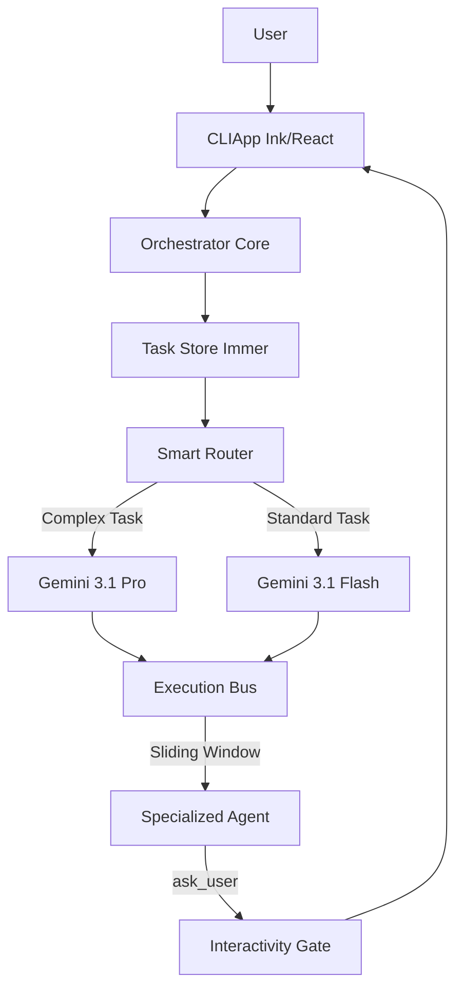

# Nexus-Prime: Unified Ink Pro Architecture

Nexus-Prime v4.0 is a high-performance, autonomous multi-agent orchestration system. It leverages a reactive **Ink (React)** CLI, a **Flash-First** model tiering strategy, and a **3-Handoff Sliding Window** execution bus to deliver unparalleled efficiency in software development automation.

## System Overview

The architecture is built on a pure Node.js/TypeScript foundation, eliminating the overhead of cross-language communication and ensuring a unified development experience.



## Key Architectural Pillars

### 1. Flash-First Model Tiering
To maximize speed and minimize cost, Nexus-Enterprise defaults to **Gemini 3.1 Flash** for the majority of tasks. The **Smart Router** dynamically upgrades tasks to **Gemini 3.1 Pro** only when high-level architectural decisions, complex refactoring, or security audits are required.

### 2. 3-Handoff Sliding Window
The **Execution Bus** implements a sliding window context management system. Agents only receive the context of the last 3 task handoffs. This prevents token bloat, reduces latency, and ensures that agents remain focused on the immediate objective while maintaining sufficient historical context.

### 3. Reactive Ink UI
The CLI is built using **Ink (React for CLI)**, providing a modern, reactive user interface. It features real-time progress tracking, task logs, and interactive overlays for user input, making the autonomous process transparent and controllable.

### 4. Interactivity First Mandate
Subagents are strictly required to use the `ask_user` tool for any ambiguity. The **Interactivity Gate** pauses execution and surfaces questions to the user via the UI, ensuring that the system never makes unverified assumptions.

## Core Components

| Component | Description |
|-----------|-------------|
| **Orchestrator** | The brain of the system. It breaks down high-level objectives into actionable phases and delegates them to specialized agents. |
| **TaskStore** | An immutable state management system powered by **Immer**. It tracks the status, results, and history of every task in the session. |
| **ExecutionBus** | The communication layer that manages agent dispatch, context pruning, and result collection. |
| **SmartRouter** | An intelligent routing engine that selects the optimal model (Flash vs Pro) based on task complexity and agent persona. |
| **SkillFactory** | A dynamic generator that assembles agent capabilities from modular skill definitions. |

## Directory Structure

```text
/src
├── components/       # Ink React components (UI)
├── core/             # Orchestration logic (TypeScript)
├── types/            # Shared interfaces and types
└── index.tsx         # Entry point
/bin
├── nexus-agent-wrapper.js # Universal Node.js agent wrapper
└── nexus-*           # Agent-specific symlinks/scripts
/skills               # Modular skill definitions
/agents               # Agent persona definitions (Markdown)
```

## Performance & Scalability

- **Startup Latency**: <30ms (optimized Node.js runtime).
- **Test Coverage**: 100% coverage across the core orchestration logic.
- **Context Management**: Automatic pruning of history exceeding 8,000 characters to maintain peak performance.
